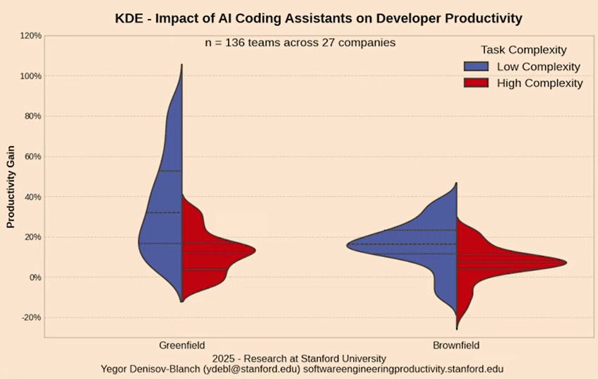

<div align="center">

# Knower

### One memory. Every tool.

**AI memory is not a model quality problem. It's an architecture problem.**

Claude remembers. Cursor remembers. But their memory is locked inside their own silo.
Switch tools, start over. Use two in parallel, they share nothing.
Your memory doesn't belong to you and it never follows you.

Knower is a **local, portable memory service** that decouples memory from the tool.
One vault. Every agent. One call away.


</div>

## **Quick start**

```bash
git clone git@github.com:Birium/mistral-hackathon.git && cd knower
./install.sh                        # ~2 GB model download, one-time
knower config vault ~/my-vault
knower start                        # Launch the Knower Core
knower web                          # http://localhost:8000 - Interact with your vault
```

→ Full install guide, MCP integrations, and CLI reference: **[INSTALL.md](INSTALL.md)**

---

## The Problem

### You re-explain yourself. Every. Single. Session.

You open Mistral. You need help with your project. So you explain the stack, the constraints, the decisions you made two weeks ago, the thing you tried and abandoned. You do it again in Claude. Again in Gemini. Every session starts from zero because no tool remembers what you already told another one.

This is not a minor annoyance. It's your **daily workflow**: rebuilding context that already exists somewhere, just not _here_.

### Memory is siloed by design

This isn't a UX problem. It's an **architecture problem**.

Claude has memory. Cursor has rules. Knower has a vault. None of them talk to each other. Switch tools, start over. Use two in parallel, they share nothing.


> Your memory is locked in silos that don't belong to you.

### Context rots. Nobody maintains it.

You write some rules in a file. Ten lines. Clear, useful. Three sprints later it's 200 lines. Half of it outdated, half of it contradicting decisions made since. Nobody fixes it. Nobody knows which half is wrong.

Every developer who works with AI agents knows this: **context rots**. Maintaining it manually is a second job that nobody actually does.

### When the agent searches its own memory, it gets dumber

Here's the part that's less obvious — and it's the architectural insight everything else builds on.

When an agent retrieves context using its own tools — `grep`, `read`, `tree` — all that exploration **lives inside its context window**. The context window is the agent's working memory. Fill it with search results and file reads, and there's less room left to _think_.

| Research                        | Finding                                                                                                                              |
| ------------------------------- | ------------------------------------------------------------------------------------------------------------------------------------ |
| **Stanford 2025** (n=136 teams) | AI productivity gain drops sharply on complex brownfield tasks vs. simple greenfield ones — context saturation is the central cause  |
| **NoLiMa Benchmark**            | Model performance degrades with context length; degradation is more severe when relevant information is buried in irrelevant content |
| **Needle-in-Haystack**          | Retrieval accuracy collapses at large context depths — even on models that claim 200K tokens                                         |



Three independent research results, same conclusion: loading memory directly into the agent's context window is **quantifiably damaging to reasoning quality**. The smarter the task, the worse this gets.

This is why Knower is a **separate process**. The agent calls Knower, receives a clean Markdown chunk back, and keeps its context window free for the actual work.

Want to learn more about those papers ? [Read the research papers](https://github.com/Birium/mistral-hackathon?tab=readme-ov-file#the-research)

---

## Why Existing Solutions Miss

The problem isn't that memory doesn't exist. It's that every memory is a silo owned by someone else.

| Solution                  | What it does       | Why it's not enough                                                         |
| ------------------------- | ------------------ | --------------------------------------------------------------------------- |
| Claude memory             | Stores preferences | Locked inside Claude                                                        |
| Cursor rules              | Project context    | Only for coding, only in Cursor                                             |
| Notion/Drive + chatbot    | File storage       | Agent navigates blind — no predictable structure                            |
| Knowledge graphs (Neo4j…) | Entity relations   | Too atomic; LLMs can't build coherent understanding from disconnected nodes |

### OpenClaw and claude-mem

These are the closest things to Knower in the current landscape, and they're worth addressing directly.

**OpenClaw** is a memory agent for code (file reading, structure navigation, project context). It does useful things. **claude-mem** uses Claude Code hooks to persist context across sessions. Also useful.

The problem they share is the same. They're **locked in their ecosystem**. OpenClaw works inside the OpenClaw ecosystem. claude-mem works via Claude Code hooks — exclusively. Switch to Mistral Vibe for a session, or run a custom agent for a batch job, and neither helps you.

Knower is architecturally different in one precise way: it's a **standalone service**, not a plugin or a feature of any existing tool. It exposes MCP and REST. Any MCP-compatible agent can call it — Mistral Vibe, Claude Code, Open Code, a custom script, a homemade agent. Knower doesn't know which client is calling and doesn't care. The vault is the single source of truth. The client is irrelevant.

---

## How Knower Works

### The Jarvis model

Tony Stark walks out of a meeting and says:

> _"Jarvis — the client wants option B, we're dropping the external API, delivery is end of March."_

Integrated. Structured. Everything else updated accordingly. Jarvis doesn't ask _"which project was that again?"_ — he has the context.

That's the interaction model Knower is built around. You send information in any form. It gets structured, routed, and stored. When you need context, from any tool, it's there, complete and ready.

### Action memory, not passive memory

Knower is not a preferences store. It doesn't save snippets or surface recall suggestions.

It maintains a **structured, complete memory** that enables any AI calling it to act with full context. The difference:

- **Passive memory** (Claude memory, ChatGPT memory): stores preferences and conversation fragments
- **Action memory** (Knower): maintains a living, structured record that an agent can reason from and act on

### Why a separate process

When an agent searches memory with its own tools, that work fills its context window. A context window saturated with memory retrieval is a context window that **can't reason about your actual task**.

Knower separates the concerns. The three research results in the Problem section aren't illustrative — they're the direct justification for this architectural decision. The agent calls Knower, gets a clean Markdown chunk, keeps its window free.

---

## The Three Magic Moments

These are the three things the demo will show. They're worth understanding before you see them.

### 1. You send raw input — it structures itself

You drop a transcribed voice note, a quick message, an email. You don't format anything, you don't decide where it goes. The system understands what it is, updates the relevant project state, adds tasks, logs decisions. The file tree updates in real time in front of you. It's not a black box, you can watch the work happen.

### 2. You ask a question — you get real context

_"Where are we on project X?"_ or _"Why did we abandon that idea?"_ The system doesn't give you generalities. It traverses your memory, assembles the relevant pieces and returns precise context drawn entirely from what you gave it: dated decisions, changelog entries, a live state file.

### 3. The system doubts — it shows you everything

When an input is too ambiguous to route confidently, it doesn't get lost, it doesn't get misfiled, and the agent doesn't interrupt its loop to ask. An item appears in the **Inbox**. Inside that item: the agent's full reasoning — what it searched, which projects it checked, what it found or didn't find, what it proposes, and the exact question it's asking you.

You don't re-explain from scratch. You complete a reasoning that's already been built. The friction is intentional, minimal, and useful.

---

## Architecture

### The Vault

```
vault/
├── overview.md       # loaded first by every agent — the map of everything
├── profile.md        # who you are, preferences, recurring constraints
├── tasks.md          # global tasks — live view only, completed tasks become changelog events
├── changelog.md      # global log — grows indefinitely, never archived
├── inbox/            # ambiguous items waiting for your input
│   └── 2025-07-14-meeting-client/
│       ├── review.md         # agent's full reasoning, exposed
│       └── transcript.md     # original input, untouched
├── bucket/           # raw input files not yet attached to a project
└── projects/
    └── startup-x/
        ├── description.md    # what the project is, decisions, constraints
        ├── state.md          # current snapshot — volatile, updated frequently
        ├── tasks.md          # project tasks, live view only
        ├── changelog.md      # project history and decisions
        └── bucket/           # raw files belonging to this project
```

Every file has YAML frontmatter (`created`, `updated`, `tokens`). The `updated` and `tokens` fields are managed by a **background job** — not by agents. After each vault write, the background job recalculates tokens, updates frontmatter, and re-indexes the modified file in QMD. Agents write content. The plumbing runs itself.

### Why Markdown

The portable format and human readability are real benefits. But they're not the reason.

The real argument is **structure as language**. The vault structure is always the same. An `overview.md` is always the map. A `changelog.md` is always H1/day, H2/entry, newest-first. A `state.md` is always a volatile snapshot with named sections.

An agent that knows this structure **doesn't discover it each session — it knows it from the first tool call**, because the structure is defined once in the system prompt. It knows that `state.md` is for current snapshot, that searching "bloqué" across all `state.md` files answers "which projects are blocked".

Compare this to a Google Drive with a chatbot: the agent lands on files blindly, has no predictable structure to reason from, and loses all connections between projects. Knower's vault isn't a file format choice — it's a memory architecture where the structure itself is the shared language between developer and agent.

The ecosystem is converging here for the same reason. Claude Code, OpenClaw, and Letta all chose Markdown. It's not by coincidence.

### The Two Agents

Both agents run on **`mistral-large-2512`** via OpenRouter, with tool-calling in an agentic loop. On startup, each loads `overview.md` + `tree.md` + `profile.md` as base context.

The model choice is deliberate. The update agent's hardest tasks — routing ambiguous information, detecting contradictions between new input and existing vault content, generating `review.md` with exposed reasoning — require a large context window and strong reasoning. These are exactly the tasks where Mistral Large performs. The demo is a concrete demonstration of what Mistral can do on long, autonomous agentic tasks.

The OpenRouter layer means the model is a configuration variable, not a hard dependency. If a new Mistral model outperforms on routing and memory structuring tasks tomorrow, Knower adapts in one line. The vault stays intact. Every project, decision, and history entry remains — independent of the model.

| Agent      | Role                                  | Available tools                                                       |
| ---------- | ------------------------------------- | --------------------------------------------------------------------- |
| **Update** | Routes new information into the vault | `tree`, `read`, `search`, `write`, `edit`, `append`, `move`, `delete` |
| **Search** | Read-only retrieval                   | `tree`, `read`, `search`, `concat`                                    |

**Update agent** reads, navigates, and modifies vault files. It searches before writing — never creates duplicates, never contradicts existing decisions silently. Every change is logged to `changelog.md`. When routing is ambiguous, it creates an inbox item rather than guessing.

**Search agent** is architecturally read-only — a guarantee, not a convention. It can run in parallel with ongoing updates without any write conflict risk. It returns a two-part document: an agent-written orientation (what it found and where) followed by the raw vault files assembled by `concat`, unchanged.

Both agents run inside a **base agentic loop** (`BaseAgent`) with a safety cap (max 25 iterations, then a forced final response).

### The Inbox — ambiguous routing, fully exposed

When the update agent can't route an input with confidence, it doesn't guess and it doesn't silently fail. It creates a folder in `inbox/` containing the original input files and a `review.md` that exposes its full reasoning: what it searched, which projects it checked, what it found or didn't find, what it proposes, and the exact question it's asking.

When the user responds, they send their answer with an `inbox_ref` pointing to that folder. The agent reads the `review.md` from the previous session — the reasoning is already built, it doesn't start over — routes the files, deletes the folder, and logs in `changelog.md`. Two separate sessions, one continuous reasoning thread.

This solves the classic agentic failure mode: agents that either block on ambiguity or make silent choices that corrupt memory over time.

### Token Economy

The agents are intentionally generous with context — and this is by design, not accident.

Memory tasks are fundamentally different from code generation tasks. A code agent at 128K+ tokens sees precision degrade because syntactic accuracy is unforgiving. A memory agent at the same depth is reading structured Markdown, routing information, writing changelog entries — tasks that are far more tolerant of context volume. More context makes the memory agent _better_, not worse.

The operational budget is 200–300K tokens per session. Typical sessions run well below that. But the tools are built to handle scale:

- **`append` without pre-read** — a 300-day changelog can be 60K tokens. `append` inserts a new entry at the top without ever opening the existing content. 60K tokens saved on a single operation.
- **`read` with `head`/`tail`** — to calibrate a new changelog entry, the agent reads the first 2K tokens (most recent entries, newest-first). Not 60K.
- **`search` for targeted chunks** — before deciding whether to read a full file, the agent searches and receives 3–4 relevant chunks. It loads 2K tokens instead of 30K, then reads the full file only if needed.

This is what allows Knower to manage vaults with hundreds of thousands of tokens while keeping active context consistently under budget.

### Search — QMD

Knower uses [**QMD**](https://github.com/tobilu/qmd) as its local search engine. No external API, no cloud — everything runs on your machine.


All models are local GGUF files, cached once at `~/.cache/qmd/models/` (~2 GB total):

| Model                    | Size    | Role                                                                    |
| ------------------------ | ------- | ----------------------------------------------------------------------- |
| **Qwen3 1.7B + LoRA**    | ~1.1 GB | Query expansion — HyDE documents, semantic variants, keyword expansions |
| **GGUF embedding model** | ~300 MB | Vector embeddings for semantic search over vault content                |
| **LLM Reranker (0.6B)**  | ~640 MB | Re-scores fused results for final ranking precision                     |

Two search modes exposed to agents:

| Mode   | Pipeline                                                     | Speed              |
| ------ | ------------------------------------------------------------ | ------------------ |
| `fast` | BM25 keyword match only                                      | Instant            |
| `deep` | Full pipeline: expansion → parallel search → fusion → rerank | Slower (CPU-bound) |

First boot downloads all models; subsequent boots use cache.

### The Cross-Tool Scenario

This is what "one memory, every tool" means in practice.

You're working in **Mistral Vibe** on a new feature. Knower injects the project context via MCP — architecture decisions, current constraints, active tasks. You code. You switch to **Claude Code** for a debugging session. Knower injects the same context from the same vault. You don't explain anything to Claude Code. The vault is the single source of truth; both agents read from the same place. When one writes an update, the next session from either client sees it.

Same vault. Three entry points, all live simultaneously:

```
MCP  →  Claude Code, Cursor, Mistral Vibe, any MCP-compatible client
API  →  any script, any program (POST /update, POST /search)
CLI  →  you, directly, no intermediary
```

---

## Stack

| Layer            | Technology                                                                        |
| ---------------- | --------------------------------------------------------------------------------- |
| **Core**         | Python, FastAPI, asyncio queue, watchdog file watcher                             |
| **Agents**       | `mistral-large-2512` via OpenRouter — agentic tool-calling loop, streaming events |
| **Search**       | QMD — BM25 + vector + LLM reranker, fully local and offline                       |
| **Frontend**     | React + Vite + Shadcn/UI + Tailwind                                               |
| **Storage**      | Plain Markdown files with YAML frontmatter                                        |
| **Connectivity** | MCP server (SSE + Streamable HTTP), REST API, bash CLI                            |

---

## The Research

Three independent sources, same conclusion — cited not as decoration but as the direct justification for the separate-process architecture.

**Stanford 2025** (n=136 teams, 27 companies) — [[video]](https://youtu.be/tbDDYKRFjhk?si=As1sDw1eBTdOylKz)
AI productivity gains drop sharply on complex brownfield tasks vs. simple greenfield ones. The central cause is context management: the more complex the task, the more existing context the agent must navigate, the more the context window saturates, the less the agent can reason. Knower moves context retrieval out of the agent's window.

**NoLiMa Benchmark** — [[paper]](https://arxiv.org/pdf/2409.15152)
Model performance degrades with context length. The degradation is more severe when relevant information is buried inside irrelevant content — exactly what happens when an agent loads an entire vault to find one decision.

**Needle-in-Haystack** — [[paper]](https://arxiv.org/pdf/2407.01437)
Retrieval accuracy collapses at large context depths — including on models claiming 200K token windows. The theoretical capacity and the practical retrieval precision are not the same thing. This benchmark is now a standard reference for qualifying real context window limits.

All three converge: loading memory into the main agent's context window is not just token-wasteful — it's quantifiably damaging to reasoning quality. This is not a comfort choice. It's a design decision in the data.

---

<div align="center">

**Your memory. Not theirs.**

Built with `mistral-large-2512` for the [Mistral × Hackathon 2026](https://worldwide-hackathon.mistral.ai/).

</div>
